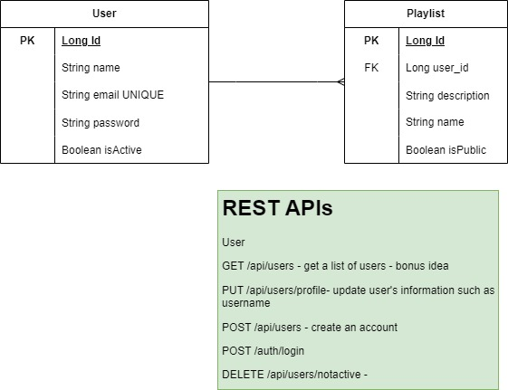
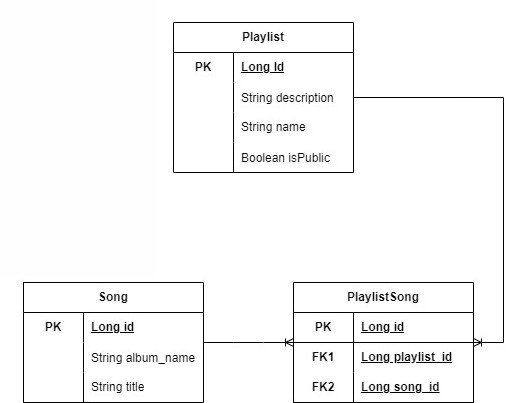

# Audio Galaxy Streaming API
Streaming Music App That Is Out of This World!

## Tables of Contents

- [Project Planning](https://github.com/users/pophero110/projects/7)
- [Project Overview](#project-overview)
- [User Stories](#user-stories)
- [MVP](#mvp-------completed-------not-completed)
- [ERD](#erd)
- [REST Endpoints](#rest-endpoints)
- [How To User Audio Galaxy Streaming API](#how-to-user-audio-galaxy-streaming-api)
- [Favorite Parts](#favorite-parts)
- [Wins & Hurdles](#wins--hurdles)
- [Languages Used](#languages-used)
- [Works Sited](#works-sited)

***
## Project Overview

Lorem ipsum dolor sit amet, consectetur adipiscing elit. Nulla hendrerit purus ut nibh sollicitudin, 
et commodo ipsum malesuada. Fusce vel malesuada velit. Vivamus quis ipsum at leo fringilla condimentum. 
Maecenas a tortor at odio viverra aliquet. Curabitur sed odio convallis, congue est id, pellentesque elit. 
Aenean interdum lacus ac odio fringilla cursus. Quisque gravida sapien ut risus aliquam, eu dignissim lectus 
venenatis. Nunc convallis est vitae semper convallis. Suspendisse potenti. Mauris nec nulla risus.

***

## User Stories

#### <ins>Unauthenticated User</ins>
- [X] As a user, I'm able to create an account and access public resources so I'm able to log in
- [X] As a user, I'm able to log in to my account so I can access authenticated resources.

#### <ins>Authenticated User</ins>

#### User
- [ ] As a user, I'm able to update my profile such as username so I can correct any typo in the username
- [ ] As a user, I'm able to delete my account so I can remove my information from the system.

#### Playlist
- [ ] As a user, I'm able to get a list of playlists from my library so I can listen to a specific playlist
- [ ] As a user, I'm able to search other users' public playlists to add as one of my playlists.
- [ ] As a user, I'm able to create a playlist so I can organize my songs and find them easily
- [ ] As a user, I'm able to update my playlist to give it another name or make that playlist public or private.
- [ ] As a user, I'm able to delete a playlist to remove it from my library.

#### Song
- [ ] As a user, I'm able to add songs to playlists
- [ ] As a user, I'm able to delete songs from a specific playlist.
- [ ] As a user, I'm able to get a list of songs so I can see the random 50 songs.
- [ ] As a user, I'm able to search for a song by title, artist name, or genre in order to add it to my playlist

***

## MVP ( - ✓ - Completed / - ✗ - Not Completed)

***
## ERD

#### User & Playlist ERD  
  

#### Playlist & Song ERD  
  
[ERD Resource Link](https://drive.google.com/file/d/1aKHH1yrHc_hTh5BsFtUyS7XPm4ydv1Rg/view?usp=sharing)

***

## Rest Endpoints

***

## How To User Audio Galaxy Streaming API

***

## Favorite Parts

***

## Wins & Hurdles

***

## Languages Used

***

## Works Sited
We utilized this [tool](https://app.diagrams.net/) for creating ERD diagrams - [Google Diagrams](https://app.diagrams.net/)