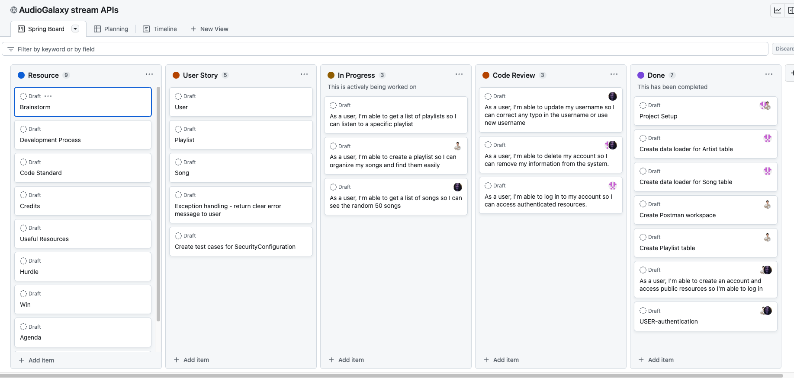
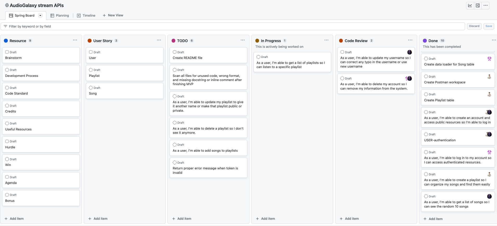
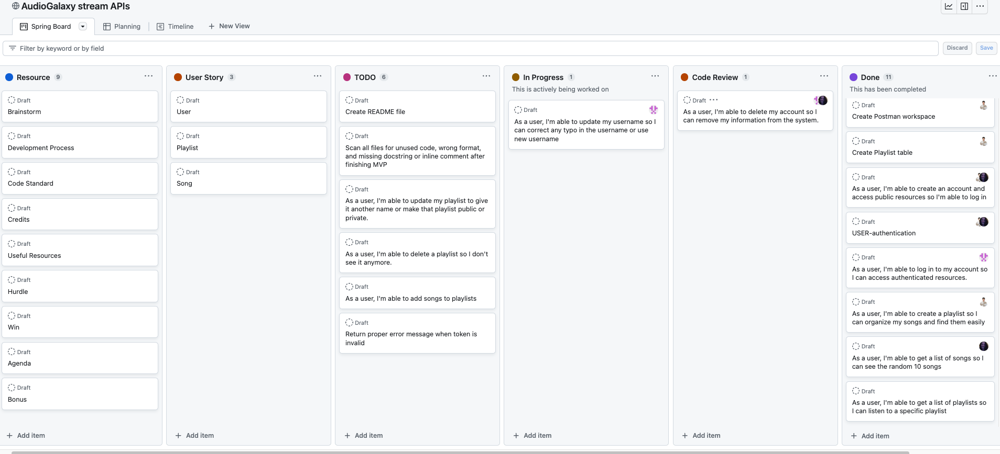
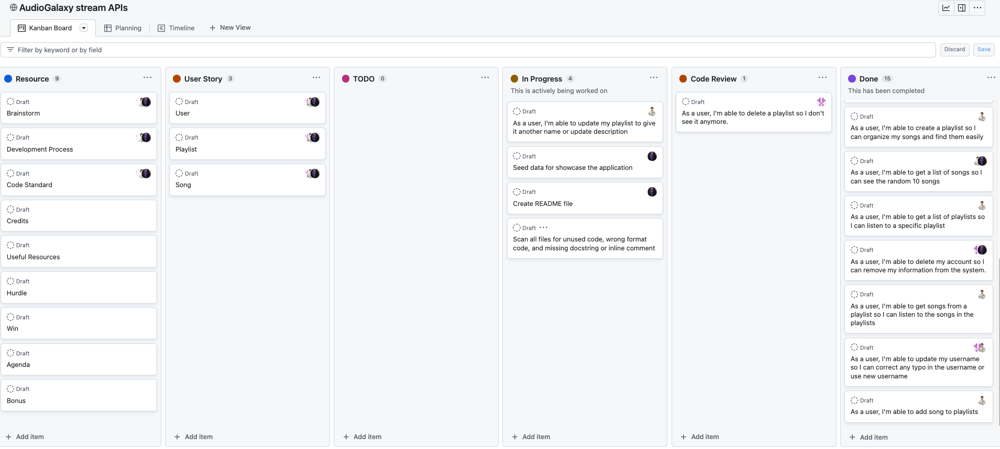
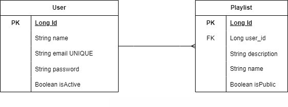
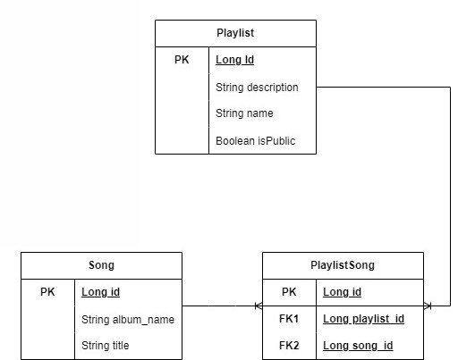

# Audio Galaxy Streaming API

A Streaming Music App That Is Out of This World!

## Tables of Contents

- [Project Overview](#project-overview)
- [Project Planning](#project-planning)
- [User Stories](#user-stories)
- [MVP](#mvp-------completed-------not-completed)
- [ERD](#erd)
- [REST Endpoints](#rest-endpoints)
- [How To Install Dependencies](#how-to-install-dependencies)
- [Favorite Parts](#favorite-parts)
- [Wins & Hurdles](#wins--hurdles)
- [Technologies & Tools](#technologies--tools)
- [Credits](#credits)

***

## Project Overview

This was a group project which consisted of 3 group
members [Jeff Ou](https://www.linkedin.com/in/jiajin-ou-87330a1b1/), [Wanda Avery](https://linkedin.com/in/wanda-simien-avery-48588a1bb) & [Pamela Afaneh](https://www.linkedin.com/in/pam-afaneh/).
The goal of the project was to create a REST API that consisted of 3 models with Spring Security and JWT Tokens. The
chosen theme for the app was inspired by Spotify. We arrived at the name of our App to be Audio Galaxy Streaming App.

Users can interact with the app to conduct CRUD action by creating an account, as well as adding,updating and deleting
songs from their created playlist.

## Project Planning

### Progress Snapshot 1

<br><br>

### Progress Snapshot 2

<br><br>

### Progress Snapshot 3

<br><br>

### Progress Snapshot 4

<br><br>

[View Planning Kanban Board](https://github.com/users/pophero110/projects/7)

***

## User Stories

#### <ins>Unauthenticated User</ins>

- As a user, I'm able to create an account and access public resources so I'm able to log in<br>
- As a user, I'm able to log in to my account so I can access authenticated resources.

#### <ins>Authenticated User</ins>

#### User

- As a user, I'm able to update my profile such as username so I can correct any typo in the username
- As a user, I'm able to delete my account so I can remove my information from the system.

#### Playlist

- As a user, I'm able to get a list of playlists from my library so I can listen to a specific playlist
- As a user, I'm able to create a playlist, so I can organize my songs and find them easily
- As a user, I'm able to update my playlist to give it another name or description.
- As a user, I'm able to delete a playlist to remove it.

#### Song

- As a user, I'm able to add songs to playlists
- As a user, I'm able to delete songs from a specific playlist.
- As a user, I'm able to get a list of songs, so I can see the top 10 songs.

***

## MVP ( - ✓ - Completed / - ✗ - Not Completed)

1. Should consist of 3 models. - ✓
2. The environment settings should be using Spring Profiles. - ✓
3. Use a combination of Spring Security and JWT Tokens. - ✓
4. The routes should be protected by JWT except for login/register. - ✓
5. A minimum of 1 REST API point that is fully CRUD operable. - ✓
6. API endpoints must be able to perform CRUD based on business use-case. - ✓
7. Provide CRUD routes that were built based on rest conventions to be a part of the API. - ✓
8. Have graceful exception handling in place. - ✓
9. In the event that an exception occurs, you should send error message to user. - ✓
10. Code on different branches during development. - ✓
11. Utilize KISS & DRY Principals. - ✓
12. Write code that is test driven with TDD Approach. - ✓
13. Unit test the controller & service classes with MockMVC. - ✓
14. Write Doc Strings for each method. - ✓
15. Provide REST Endpoints. - ✓

***

## ERD

#### User & Playlist ERD <br>

<br><br>

#### Playlist & Song ERD <br>

<br><br>
[ERD Resource Link](https://drive.google.com/file/d/1aKHH1yrHc_hTh5BsFtUyS7XPm4ydv1Rg/view?usp=sharing)

***

## Rest Endpoints

#### <ins>Playlist Endpoints</ins>

| Request Type | URL                         | Functionality                       | Access  |  
|--------------|-----------------------------|-------------------------------------|---------|
| POST         | api/playlists               | Create Playlist                     | Private |   
| GET          | api/playlists               | Get all Playlists                   | Private |   
| GET          | api/playlists/{playlistId}/ | Get songs from a specific Playlists | Private |   
| PUT          | api/playlists/{playlistId}/ | Update a specific Playlists         | Private |

#### <ins>User Endpoints</ins>

| Request Type | URL              | Functionality | Access  |
|--------------|------------------|---------------|---------|
| POST         | api/users/       | Register      | Public  | 
| POST         | api/users/login/ | Login         | Public  |  
| PUT          | api/users/       | Update User   | Private |   

#### <ins>Song Endpoints</ins>

| Request Type | URL                               | Functionality                      | Access  | 
|--------------|-----------------------------------|------------------------------------|---------|
| GET          | api/songs/                        | Get a list of top 10 songs         | Private |
| POST         | api/playlists/{playlistId}/songs/ | Add a song to a specific Playlists | Private |  

<br>

***

## How To Install Dependencies

#### List of dependencies used

- SpringBoot
    - Starter REST
    - Dev Tools
    - JPA
    - Starter Security
    - Plugin/Mavin
- H2 Database
- Junit
- JWT Token
- JJWT Jackson

#### How to install dependencies

Copy and paste the code below into your pom.xml file. Once copied right mouse click on your pom.xml file and select
Maven and then Reload project. This will install the dependecnies.
<br><br>

```

	<dependencies>
		<dependency>
			<groupId>org.springframework.boot</groupId>
			<artifactId>spring-boot-starter-data-rest</artifactId>
		</dependency>
		<dependency>
			<groupId>org.springframework.boot</groupId>
			<artifactId>spring-boot-devtools</artifactId>
			<scope>runtime</scope>
			<optional>true</optional>
		</dependency>
		<dependency>
			<groupId>com.h2database</groupId>
			<artifactId>h2</artifactId>
			<scope>runtime</scope>
		</dependency>
		<dependency>
			<groupId>org.springframework.boot</groupId>
			<artifactId>spring-boot-starter-jdbc</artifactId>
		</dependency>
		<dependency>
			<groupId>org.springframework.boot</groupId>
			<artifactId>spring-boot-starter-test</artifactId>
			<scope>test</scope>
		</dependency>
		<dependency>
			<groupId>org.springframework.boot</groupId>
			<artifactId>spring-boot-starter-data-jpa</artifactId>
		</dependency>
		<dependency>
			<groupId>junit</groupId>
			<artifactId>junit</artifactId>
			<scope>test</scope>
		</dependency>

		<dependency>
			<groupId>org.springframework.boot</groupId>
			<artifactId>spring-boot-starter-security</artifactId>
		</dependency>

		<!-- https://mvnrepository.com/artifact/io.jsonwebtoken/jjwt-api -->
		<dependency>
			<groupId>io.jsonwebtoken</groupId>
			<artifactId>jjwt-api</artifactId>
			<version>0.11.5</version>
		</dependency>
		<!-- https://mvnrepository.com/artifact/io.jsonwebtoken/jjwt-impl -->
		<dependency>
			<groupId>io.jsonwebtoken</groupId>
			<artifactId>jjwt-impl</artifactId>
			<version>0.11.5</version>
			<scope>runtime</scope>
		</dependency>
		<!-- https://mvnrepository.com/artifact/io.jsonwebtoken/jjwt-jackson -->
		<dependency>
			<groupId>io.jsonwebtoken</groupId>
			<artifactId>jjwt-jackson</artifactId>
			<version>0.11.5</version>
			<scope>runtime</scope>
		</dependency>
	</dependencies>

	<build>
		<plugins>
			<plugin>
				<groupId>org.springframework.boot</groupId>
				<artifactId>spring-boot-maven-plugin</artifactId>
			</plugin>
		</plugins>
	</build>


```

***

## Favorite Parts

<ins><b>Jeff's</b></ins> favorite part was reaching the MVP milestone and successfully completing the project.<br>

<ins><b>Wanda's</b></ins> favorite part was overcoming testing challenges and seeing the tests pass upon completion.<br>

<ins><b>Pam's</b></ins> favorite part was being a part of this team, as it provided her with valuable learning
opportunities.<br>

***

## Wins & Hurdles

#### <ins>Wins</ins>

Through collaboration, we reached a consensus on the following list, which we proudly consider to be our wins for this
project.

- We each acquired valuable experience and knowledge while conducting pair programming.
- We recognize the importance of efficient time management when collaborating with a team.
- We developed the ability to effectively prioritize user stories, enabling us to successfully reach the Minimum Viable
  Product (MVP).
- We are proud of the significant progress we made within the set timeframe we had.

#### <ins>Hurdles</ins>

As a team, we encountered the following list of hurdles during this project.

- <b>Working as a team with varying levels of experience:</b> We faced the challenge of leveraging each team member's
  strengths and effectively assigning tasks accordingly.

- <b>Testing controllers without authentication:</b> One of our obstacles was finding a way to test the
  controllers without the need for authentication.

- <b>Project management using Git:</b> We encountered difficulties in managing the project collaboratively using Git.
  <br>

***

## Technologies & Tools

- Java
- Spring Boot
- JWT
- Postman
- GitHub Project
- Draw.io
- H2 Database
- JUnit
- Mockito

***

## Credits

- We utilized this [tool](https://app.diagrams.net/) for creating ERD
diagrams - [Google Diagrams](https://app.diagrams.net/)<br>
- We were inspired by [Spotify](http://spotify.com) for our app.

### Jeff
- A huge thanks to [Suresh](https://github.com/sureshmelvinsigera), [Dhrubo](https://www.linkedin.com/in/dhrubo-hasan/) and [Leo](https://www.linkedin.com/in/leonardo-rodriguez/?lipi=urn%3Ali%3Apage%3Ad_flagship3_people_connections%3BiDOQ1nARTqWp8%2BgRo7bF6Q%3D%3D) who shared their feedback and suggestion at the beginning of the project
- Shout-out to my teammates for their patience, kindness, and hard work during the development of the project

### Pam
- I would like to thank Jeff for taking charge on this project with his stellar ability of planning and management.  
- I would like to thank both team members for their patience and help, it was a true pleasure working with both of you
